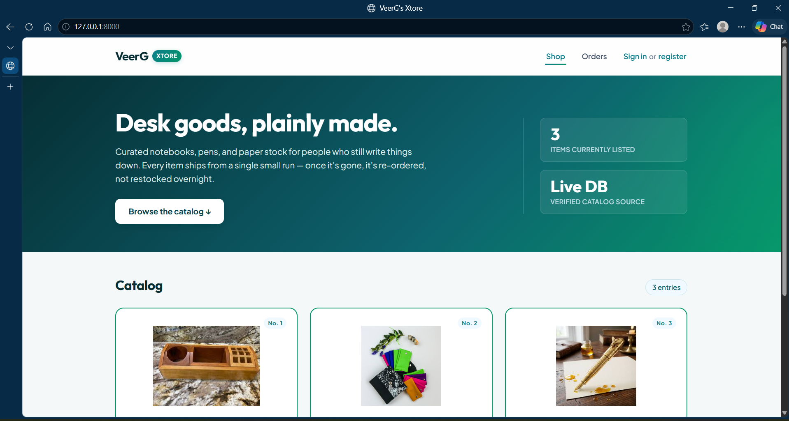
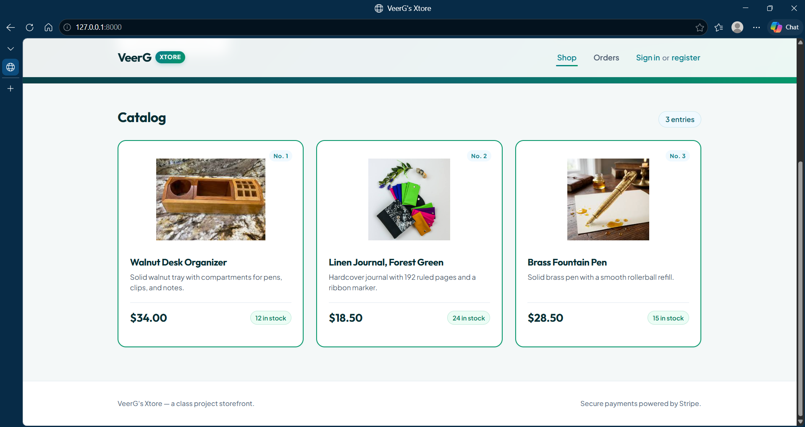
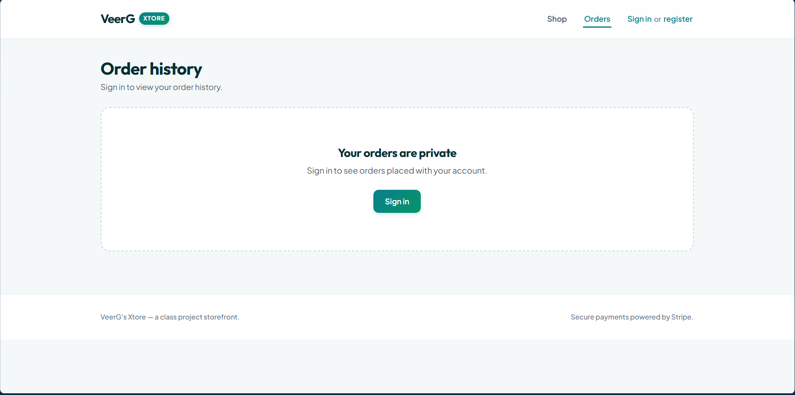
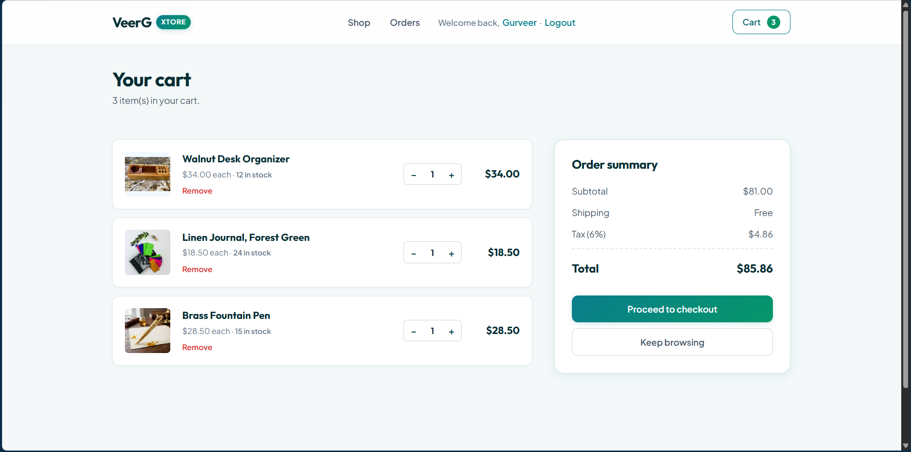
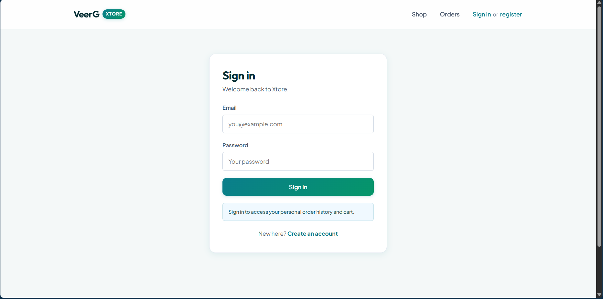
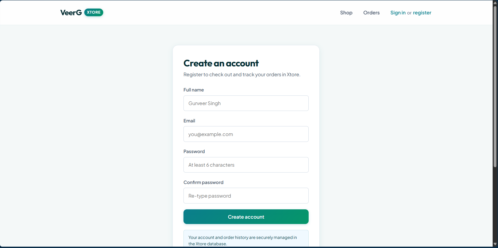
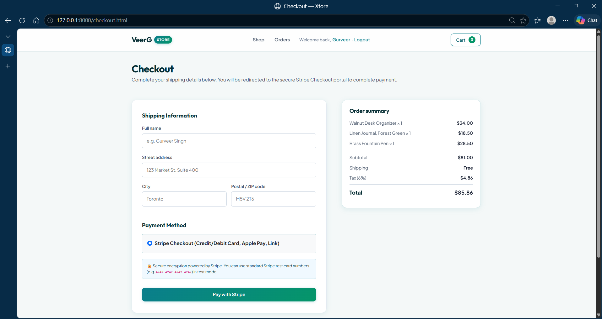
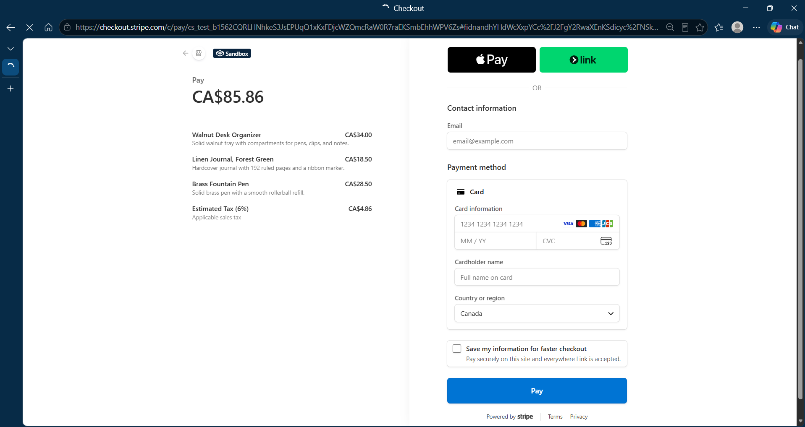
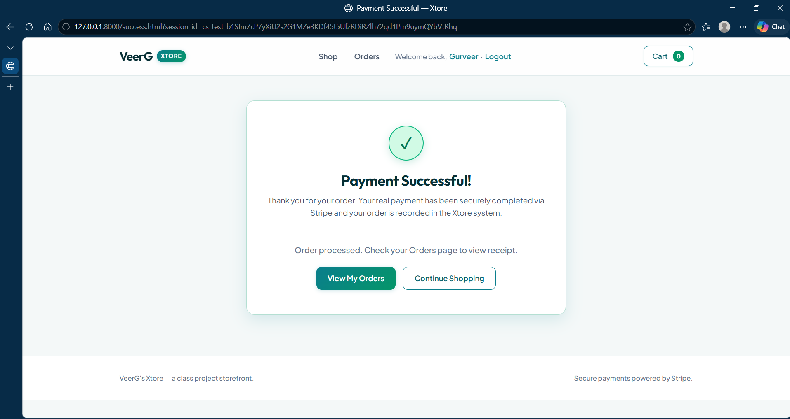

# Xtore
An eCommerce app for Stationary and Wooden storage materials like drawers, boxes.

## Tech Stack
| Layer     | Choice                                 |
|-----------|----------------------------------------|
| Backend   | FastAPI/Pydantic, SQLAlchemy, Stripe   |
| Storage   | SQLite  (Stored in Heruko's PostgreSQL) |
| Frontend  | HTML5, Bootstrap5 and CSS, JavaScript          |

## Features
1. Each item has given desription, image, price and quantity in stock.

2. Each user has unique username, purchases' history.

3. Items in cart remains same after logout unless added or removed by the user.

4. No user can access other registerd users' carts and purchases' history because of secure password hashing and session management.

5. Payments are powered by [Stripe](https://stripe.com/en-ca).

## Notes
1. **All products shown in the website are FAKE, so payment gateway has [Sandbox](https://docs.stripe.com/sandboxes)** -- This is just to showcase successful working of an E-Commerce app.
2. This app is currently under development; more features are coming.
3. **WARNING: Please do NOT use real credit/debit card details** -- only use the test card numbers provided by [Stripe](https://stripe.com/docs/testing).